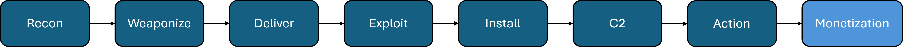

# CYBER KILL CHAIN

## What Is The Cyber Kill Chain?

The cyber kill chain was developed by [Lockheed Martin](https://www.lockheedmartin.com/en-us/capabilities/cyber/cyber-kill-chain.html). It is a seven or eight stage approach to threat actors or an Advanced Persistent Threats (APT) Tactics, Techniques and Procedures (TTPs). 

The stages of the Cyber Kill Chain

### 1. Reconnaissance

&nbsp;&nbsp;&nbsp;&nbsp;This stage is where the threat actors gather information on their target, they will get an idea of the attack surface that the target has. This can be by a passive means by looking at the company website, company social media (LinkedIn, Instagram, TikTok, etc.), employees, and company partners or vendors. This allows the threat actor to figure out where the weak points are for the company. It could be a job opening that they find and try to gain access to the company from the inside. This is just like the KnowBe4 [incident](https://www.bleepingcomputer.com/news/security/knowbe4-mistakenly-hires-north-korean-hacker-faces-infostealer-attack/) that happened in July 2024, where they hired a North Korean state actor without knowing it. They could also use the vendors as the attack vector. 
They could dive even deeper into their target by actively scanning the web application and find the IP addresses that belong to the target. The threat actor wants to gather as much information as they can to be able to plan their attack and be even more successful in the attack 

### 2. Weaponize

&nbsp;&nbsp;&nbsp;&nbsp;Here is where the threat actor will create the attack vector that will be used. At this stage the attacker should know what kind of countermeasures their target has and they try to make sure that they can remain undetected. The main goal here is to be able to have a foot hold that will be able to persist.

### 3. Delivery

&nbsp;&nbsp;&nbsp;&nbsp;The threat actor delivers the payload or exploit to the victim. This could be in the form of social enigneering or a phishing attack. They could have gone on the dark web and just paid for the credentials of an employee. If they are able to gain access to the building they could even use a USB or leave a USB in the parking lot and see if an employee is curious enough to plug it into a company system.

### 4. Exploitation

&nbsp;&nbsp;&nbsp;&nbsp;This stage is when the threat actor triggers the payload or exploit. Here is where they try to run scripts or modify permissions. This could expose more vulnerabilities in the victim's network, allowing them to move laterally within the network

### 5. Installation

&nbsp;&nbsp;&nbsp;&nbsp;In this stage the threat actor is installing all of the payloads or tools that they need in order to complete their exploit or remain undetected in the system. They will usually need some sort of privledge escalation in order to install their malware. Here are some common techniques that are used in this stage:
* **Droppers**: Is a piece of malware that delivers and installs other malware, it is used to encapsulate the malware to bypass any antimalware or other security measures
* **Backdoors**: This allows the threat actor a way back into the compromised system. This could have been what was used in the exploitation stage or could have been installed using a dropper. Once the backdoor is in place they can launch their attacks or exfiltrate data from that compromised system

### 6. Command and Control

&nbsp;&nbsp;&nbsp;&nbsp;Command and Control (C2) is a crucial step in the cyber kill chain. This allows the threat actor to monitor and guide their exploits on the victim system(s). From here they are able to further their foot hold, they can add multiple variants of their malware and try to obfuscate or hide their presence in the network

### 7. Action

&nbsp;&nbsp;&nbsp;&nbsp;The final stage in the cyber kill chain. This is what the main objective of the threat actor, which is why some people keep it seven stages versus eight because monetization could be the action for the threat actor. Getting to this stage can take several weeks or even months depending on how effective the previous stages were. Some common goals are:
* Exfiltating Data
* Ransomware Attack
* Supply Chain Attacks

Just because the Cyber Kill Chain is laid out in a linear way doesn't mean that is how the threat actor will progress. Once they are able to get into a system they are propably going to go back to the recon stage to find out more information on their victim. They could get in from a phishing email and then find out who will have the highest permissions and try and go on the dark web to find some credentials that person used and then try to gain access to their account. Or they could find out who has the power to pay vendors and send an invoice to them and get paid directly from the company. 