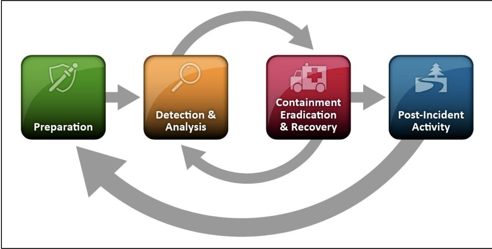

# Incident Handling Process Overview

Just like the cyber kill chain, handling an incident also has a process or how NIST calls it the *Incident Responce Life Cycle* which is in the [NIST SP 800-61](https://nvlpubs.nist.gov/nistpubs/SpecialPublications/NIST.SP.800-61r2.pdf), this publication is all about incident handling.

:memo: **NOTE:** The current revision of the SP 800-61 was published in 2012 and a new revision is currently in draft. This life cycle is completely different form the life cycle in the current draft. You can check out the public draft [here](https://nvlpubs.nist.gov/nistpubs/SpecialPublications/NIST.SP.800-61r3.ipd.pdf)

As you can see from the figure above it has four stages and it isn't linear and is cyclical, you are never done and you don't stop learning. That is why incident responders spend most of their time in the first two stages of the incident response lifecycle. You must stay on top of the latest trends and always be prepared for when an incident happens. 
The main tasks that you will be working on in incident response is *investigating* and *recovering*. The main goals of an investigation are:
* Finding the initial compromised system
* Find out what tools and malware the threat actor used
* Documentation, the number of sytems comromised and all steops taken by you and the threat actor

Once you have completed your investigation you can start the recover process. You need to create and implement a recovery plan. You can't just assume that your recovery plan fixed the issue without verifing that everything has returned back to the baseline. Only after that can you go back to operating as normal. 
Now that things have settled down you must create a report about the incident. This report can vary from organization to organization but should have a lessons learned:
* What happened and when?
* Did we have procedures, were they followed, and do they need to be changed or implemented?
* What can we do to detect this kind of incident sooner?
* What can be done to prevent this in the future?