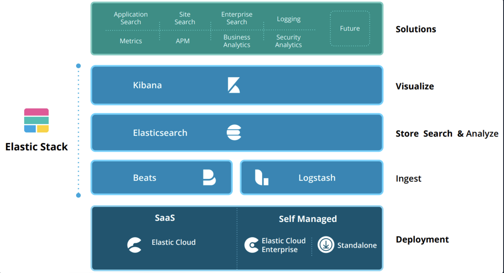
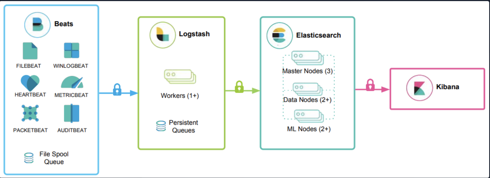
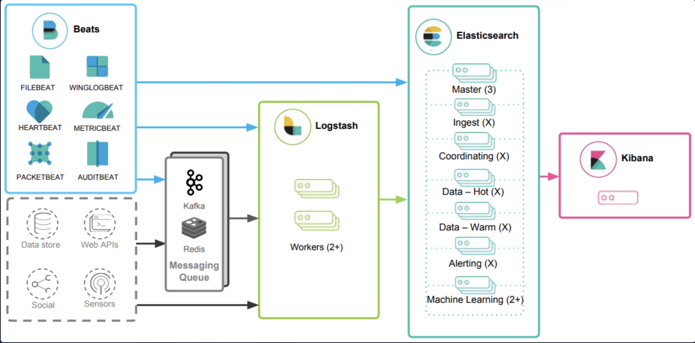

# Introduction To The Elastic Stack

## What Is The Elastic Stack?

Elastic Stack, also known as the ELK Stack, is an open-source suite designed for real-time log analysis and visualization. It primarily includes three core applications - Elasticsearch, Logstash, and Kibana - each playing a specific role in managing and interpreting log data. For enhanced performance and resilience in resource intensive environments, components like Kafka, RabbitMQ, Redis, and nginx can be integrated

**Key Components**
* **Elasticsearch**: This distributed, JSON based search engine forms the backbone of the Elastic Stack. It is responsible for indexing, storing, and querying log data. With its RESTful API, Elasticsearch enables sophisticated search queries and analytics on the data processed by Logstash
* **Logstash**: This tool is used for collecting, transforming, and transporting log data. It operates in three main stages:
    * **Input**: Logstash ingests log records from various sources, such as files, TCP sockets, or syslog messages, converting them into a machine-readable format
    * **Transformation**: Through filter plugins, Logstash can modify and enrich log records based on specific conditions or rules
    * **Output**: Processed log records are sent to Elasticsearch using output plugins
* **Kibana**: This visualization tool allows users to explore and visualize data stored in Elasticsearch. It provides a user-friendly interface for executing queries, creating custom dashboards, and displaying data through tables, charts, and other visual formats
**Additional Component**
* **Beats**: It is an additional component of the Elastic Stack. These are lightweight, single purpose data shippers installed on remote machines to forward logs and metrics directly to Logstash or Elasticsearch. Beats simplify data collection from various sources, ensuring that the Elastic Stack has the necessary information for comprehensive analysis and visualization

**Enhancements for High Resource Environments**
* **Kafka and RabbitMQ**: These messaging systems can be used for buffering and managing log data streams, improving resilience and handling large volumes of data
* **Redis**: Used for caching and as a message broker, Redis enhances performance and reliability
* **nginx**: This web server and reverse proxy can be employed for securing and managing access to the Elastic Stack components

The Elastic Stack provides a powerful, integrated solution for managing, analyzing, and visualizing log data, with additional tools and components available to optimize its performance and resilience in complex environments

## The Elastic Stack as a SIEM Solution

Elastic Stack can effectively serve as a SIEM solution, providing a comprehensive platform for collecting, storing, analyzing, and visualizing security data from various sources.

**Implementation as a SIEM**
* **Data Ingestion**: Use Logstash to ingest security related data from various sources, such as firewalls, IDS/IPS systems, and endpoints. Logstash handles the collection, transformation, and transportation of this data into the Elastic Stack
* **Data Storage and Indexing**: Configure Elasticsearch to store and index the ingested security data. Elasticsearch has powerful search and indexing capabilities allow for efficient querying and analysis of large volumes of security events
* **Data Visualization**: Utilize Kibana to create custom dashboards and visualizations that provide insights into security related events. Kibana helps in visualizing data trends and anomalies, facilitating a clearer understanding of the security landscape
* **Incident Detection**: Leverage Elasticsearch to perform searches and correlations on the data to detect security incidents. Advanced search capabilities and correlation rules help in identifying potential threats and anomalies

When working with the Elastic Stack the SOC team will be using the Kibana Query Language (KQL). KQL is a powerful tool within Kibana that simplifies data searches and analysis.
* **Basic Structure**: KQL queries are composed of *field:value* pairs, with the field being the data's attribute and value representing the data you're searching for. For example, when searching `event.code:4625` Kibana shows events related to 4625, which is failed login attempts on Windows
* **Free Text Search**: Allows searching across multiple fields for a specific term. Searching `"svc-sql1"` will look at all the indexed fields
* **Logical Operators**: KQL supports the use of operators AND, OR, and NOT to build more complex queries. `event.code:4265 AND vinlog.event_data:**SubStatus:0xC000072` filters failed logins AND a sub status that indicates the account is disabled. This can mean that a user just locked themselves out of their account or that a threat actor is trying to access the network through a disabled account
* **Comparison Operators**: The operators `:>`, `:<`, `:>=`, and `:<=` give the SOC team to query precise condition for matching field values. `event.code:4625 AND winlog.event_data.SubStatus:0x000072 AND @timestamp >= "2023-03-03T00:00:00.000Z" AND @timestamp <= "2023-03-06T23:59:59.999Z"` will look at the same information as the previous search but not it is looking at those events that took place between March 3rd through March 6th 2023.
* **Wildcards and Regular Expressions**: KQL allows the use of wildcards and regex to search for patterns. `event.code:4625 AND user.name:admin*` is looking for any failed logins with the username beginning with 'admin'. If an organization uses 'su' at the beginning of privileged account usernames you would be able to see those failed login attempts just by switching 'admin' to 'su'

## How To Identify The Available Data

Top effectively query and analyze data within the Elastic Stack, understanding the available fields and their values is essential. There are two approaches that you can use to find the available fields and values

### Leverage KQL's Free Text Search

* **Explore Data with Discover**: Utilize the [Discover](https://www.elastic.co/guide/en/kibana/current/discover.html) feature in Kibana to explore and analyze the data. This tool helps with exploring the values in the current dataset
* **Example Query**: Using our example for failed login attempts between March 3rd to March 6th 2023, you can search for the Windows event code `"4625"` it will return a few fields
    * `event.code` relates to the Elastic Common Schema (ECS), a standardized set of field names and values
    * `winlog.event_id` comes from the WinlogBeat, a Beat for collecting Windows logs
    * `@timestamp` is the time extracted from the original event, this is different from `event.created`
When you start to analyse the events you can start to dig deeper and you will find that the `event.code:4625` has a sub status code of `0xC000072`. This also relates back to the Winlogbeat, like the `winlog.event_id`

### Leverage Elastic's Documentation

It is always a good idea to look over the documentation from the vendor when you are unfamiliar with a tool. It is like using the `man` command in Linux when you are trying to learn what a certain command does. A few places to start when it comes to the Elastic Stack are:
* [ECS](https://www.elastic.co/guide/en/ecs/current/ecs-reference.html)
* [Winlogbeat fields](https://www.elastic.co/guide/en/ecs/current/ecs-reference.html)
* [Winlogbeat ECS fields](https://www.elastic.co/guide/en/beats/winlogbeat/current/exported-fields-ecs.html)
* [Winlogbeat Security Module fields](https://www.elastic.co/guide/en/beats/winlogbeat/master/exported-fields-security.html)
* [Filebeat fields](https://www.elastic.co/guide/en/beats/filebeat/current/exported-fields.html)
* [Filebeat ECS fields](https://www.elastic.co/guide/en/beats/filebeat/current/exported-fields-ecs.html)

## The Elastic Common Schema

The ECS provides a standardized vocabulary for events and logs within the Elastic Stack, ensuring consistent field formats across diverse data sources. ECS enhances the use of KQL, below are some of the advantages:
* **Unified Data View**: ECS enforces a consistent and standardized structured approach to data representation, enabling a unified view of information across the different sources like Window logs, network traffic, and cloud data. This uniformity facilitates seamless searches and correlations
* **Improved Search Efficiency**: By standardizing field names, ECS simplifies writing KQL queries. Analysts don't need to memorize different field names for the various data sources
* **Enhanced Correlation**: ECS enables easier correlation of events across multiple sources. For example, you can link an IP address involved in a security incident with network logs, firewall data, and endpoint information to get a comprehensive view of the incident
* **Better Visualizations**: Consistent field naming convention improve visualization quality in Kibana. With ECS, creating dashboards and visualizations is more straightforward, aiding in trend spotting, anomaly detection, and effective security incident visualization
* **Interoperability with Elastic Solutions**: ECS ensures compatibility with advanced features and solutions within the Elastic Stack, such as Elastic Security, Elastic Observability, and Elastic Machine Learning. This integration support advanced threat detection, anomaly monitoring, and performance analysis
* **Future Proofing**: ECS is foundation to the Elastic Stack, making it easier to integrate future enhancements and new features. Adopting ECS helps maintain compatibility with ongoing updates and improvements in the Elastic ecosystem